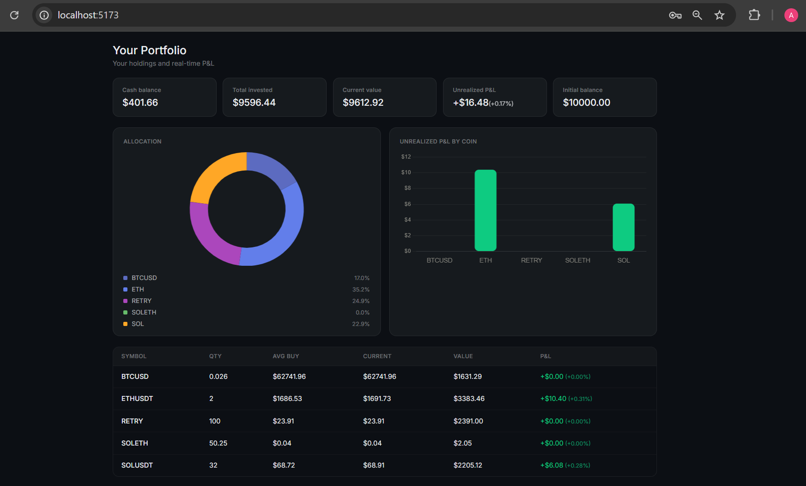
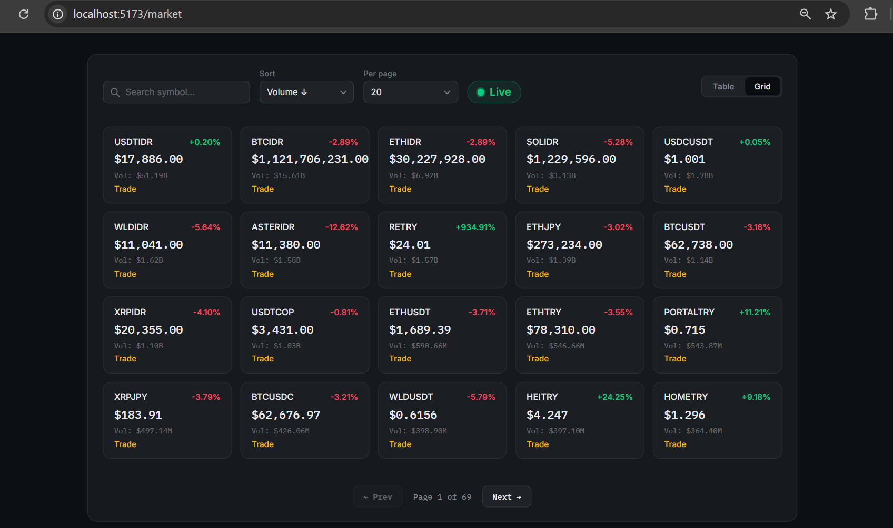
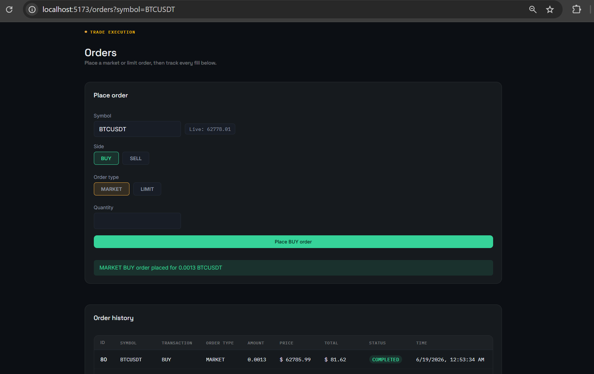
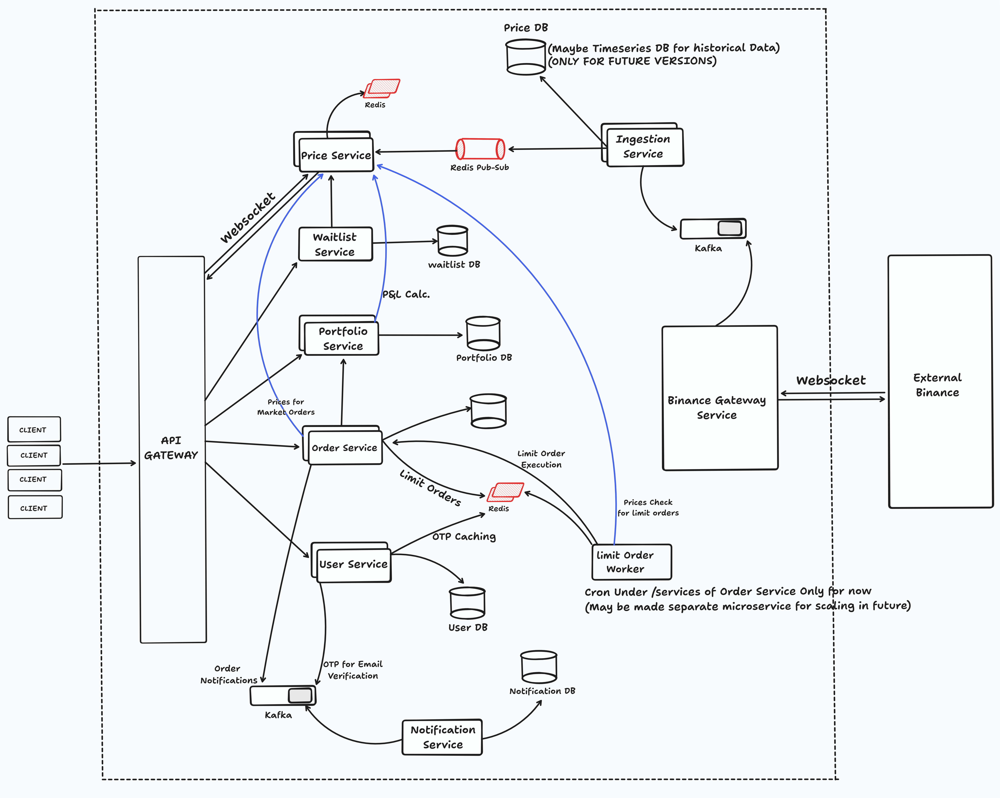

# 🚀 PaperTradeX - Real-Time Crypto Trading Simulator


> A scalable, event-driven cryptocurrency trading simulator built using a microservices architecture that allows users to practice trading with **$10,000 virtual funds** using **real-time Binance market data**.


PaperTradeX simulates a real-world trading platform where users can monitor live prices, place market and limit orders, manage portfolios, and create personalized watchlists — all without risking actual money.


---


## 📸 Application Screenshots


<table align="center">


<tr>


<td align="center">


<b>🏠 Home Dashboard</b>


<br><br>





</td>


<td align="center">


<b>📈 Markets Page</b>


<br><br>





</td>


</tr>


<tr>


<td align="center">


<b>💰 Portfolio Page</b>


<br><br>


</td>


<td align="center">


<b>📋 Orders Page</b>


<br><br>





</td>


</tr>


</table>


---


## 🏗️ High Level Design (HLD)


<p align="center">





</p>


<p align="center">


Event-driven microservices architecture built using Kafka, Redis Pub/Sub, WebSockets, and an API Gateway.


</p>


---


## ✨ Features


### 👤 Authentication & User Management


- User Registration & Login

- JWT Authentication

- Email Verification via OTP

- Secure Password Hashing


### 📈 Real-Time Market Data


- Live Binance WebSocket Integration

- Real-time price broadcasting

- Redis Pub/Sub for low-latency updates

- Optimized market data distribution


### 💰 Portfolio Management


- Initial virtual balance of **$10,000**

- Real-time portfolio valuation

- Holdings management

- Profit & Loss tracking


### 📊 Trading Engine


Supports:


- ✅ Market Orders

- ✅ Limit Orders

- ✅ Buy Orders

- ✅ Sell Orders

- ✅ Order Cancellation


### ⭐ Watchlists


- Add cryptocurrencies to watchlists

- Remove cryptocurrencies

- Personalized market tracking


### ⚡ Scalable Architecture


- Event-driven communication using Kafka

- Redis caching layer

- Independent microservices

- API Gateway architecture


---


## 🛠️ Tech Stack


| Category | Technologies |

|----------|--------------|

| Frontend | React, Vite |

| Backend | Node.js, Express.js |

| Database | MySQL, Sequelize ORM |

| Messaging | Apache Kafka |

| Caching | Redis |

| Realtime | WebSockets |

| Authentication | JWT |

| External APIs | Binance WebSocket API |


---


## 📦 Microservices


| Service | Responsibility |

|---------|----------------|

| API Gateway | Central entry point and request routing |

| User Service | Authentication and user management |

| Portfolio Service | Virtual balance and holdings management |

| Order Service | Market and limit order execution |

| Watchlist Service | Personalized watchlists |

| Price Service | Price broadcasting and caching |

| Binance Gateway | Binance market data consumer |

| Ingestion Service | Kafka consumer for market updates |


---


## 🔌 Core APIs


### User Service


```http

POST /api/v1/user/register


POST /api/v1/user/login


POST /api/v1/user/initiateVerification


POST /api/v1/user/VerifyViaOTP


GET  /api/v1/user/profile

```


### Portfolio Service


```http

GET /api/v1/portfolio


GET /api/v1/portfolio/:symbol

```


### Order Service


```http

POST  /api/v1/orders/market


POST  /api/v1/orders/limit


GET   /api/v1/orders


PATCH /api/v1/orders/:orderId/cancel

```


### Watchlist Service


```http

GET    /api/v1/watchlist


POST   /api/v1/watchlist


DELETE /api/v1/watchlist/:symbol

```


### 🔌 WebSocket Channels


#### 🏠 Home Feed


```text

/home

```


Streams live updates for watchlisted


---


#### 📈 Market Feed


```text

/market

```


Streams live updates for all supported cryptocurrencies.


---


## 📂 Project Structure


```text

PaperTradeX

│

├── frontend/

│

├── services/

│   │

│   ├── api-gateway/

│   ├── user-service/

│   ├── portfolio-service/

│   ├── order-service/

│   ├── watchlist-service/

│   ├── price-service/

│   ├── binance-gateway/

│   └── ingestion-service/

│

└── README.md

```


---


## ⚙️ Environment Configuration


Each microservice already contains its own `.env.example` file.


Create a `.env` file before running the application.


```bash

cp .env.example .env

```


Configure all required values.


---


## 🗄️ Database Setup


PaperTradeX uses **MySQL** with **Sequelize ORM**.


Database configuration is stored inside:


```text

config/config.json

```


Example:


```json

{

  "development": {

    "username": "<your_username>",

    "password": "<your_password>",

    "database": "<database_name>",

    "host": "127.0.0.1",

    "dialect": "mysql"

  },


  "test": {

    "username": "<your_username>",

    "password": null,

    "database": "<test_database>",

    "host": "127.0.0.1",

    "dialect": "mysql"

  },


  "production": {

    "username": "<your_username>",

    "password": null,

    "database": "<production_database>",

    "host": "127.0.0.1",

    "dialect": "mysql"

  }

}

```


### Create Database


```bash

mysql -u root -p

```


```sql

CREATE DATABASE paper_trade;


SHOW DATABASES;

```


### Run Sequelize Migrations


Navigate to each microservice and run:


```bash

npx sequelize-cli db:migrate

```

---


## 🚀 Local Setup


### 1. Clone Repository


```bash

git clone https://github.com/dhiman31/PaperTradeX.git


cd PaperTradeX

```


### 2. Install Dependencies


Install dependencies for every microservice and frontend.


```bash

npm install

```


### 3. Configure Environment Variables


Every service already contains `.env.example`.


Create `.env` files.


```bash

cp .env.example .env

```


### 4. Start Infrastructure Services


Make sure these are running:


- MySQL

- Redis

- Apache Kafka


### 5. Start Backend Services


Run each microservice in a separate terminal.


```bash

npm start

```


### 6. Start Frontend


```bash

npm run dev

```


## 📚 Key Learnings


This project helped me gain practical experience in:


- Designing scalable microservice architectures

- Event-driven systems using Kafka

- Redis caching and Pub/Sub

- Building real-time systems with WebSockets

- API Gateway implementation

- Trading engine design

- Service-to-service communication

- System design principles


---


## 👨‍💻 Author


**Ankush Dhiman**


🎓 Indian Institute of Information Technology Una (2024–2028)


💻 Computer Science & Technology


### Profiles


- GitHub: https://github.com/dhiman31


- LeetCode: https://leetcode.com/u/dhiman31/


- LinkedIn: https://www.linkedin.com/in/ankushdhiman-31ad/
